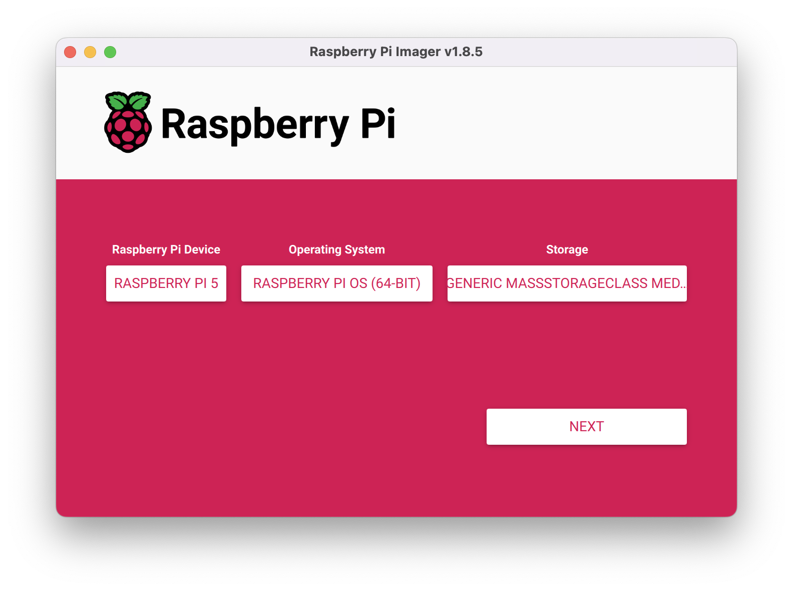
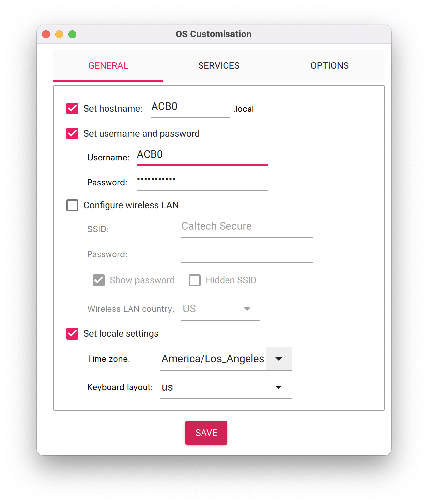
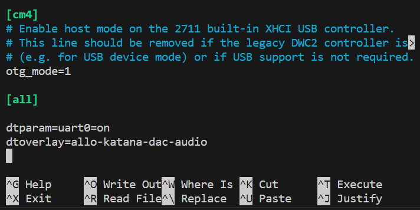
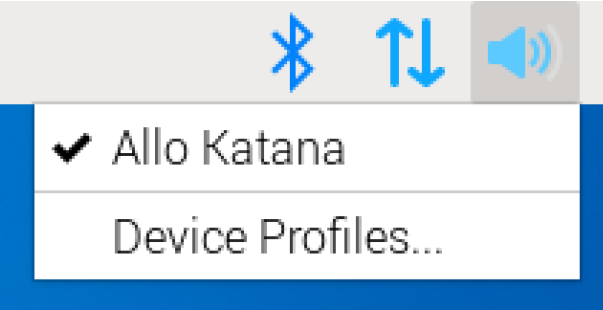
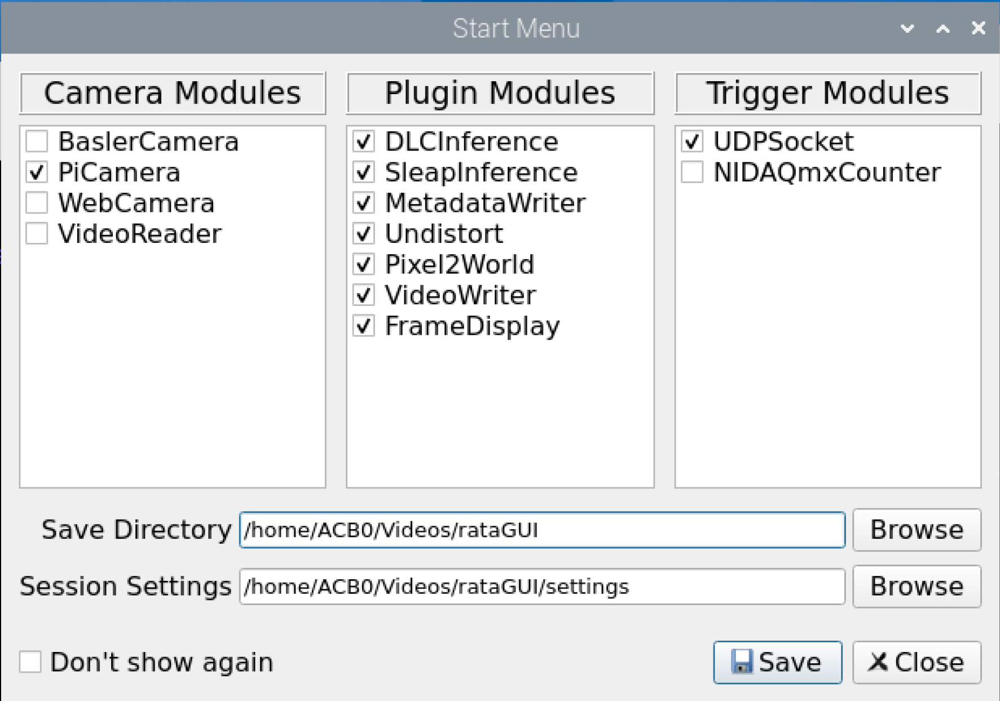

# Auditory Conditioning Box Protocol

By Charles Xu @ Siapas Lab, Caltech, 2024

## Overview

The auditory conditioning box comes in two versions, a free-behavior version and a head-fixed version to allow for electrophysiology experiments. This setup includes an auditory system, an IR camera system, and a lick reward delivery system, altogether controlled by a central Raspberry Pi computer.

## Software Configuration
### Installing Raspberry Pi OS

The Raspberry Pi works on a Linux-based operating system, [Raspberry Pi OS](https://www.raspberrypi.com/software/operating-systems/). Prepare a microSD card and flash the system onto it with your computer using the Raspberry Pi Imager.



You may customize your hostname, username, and password settings before installation.



Once imaging is complete, eject the SD card and insert it in the Pi.

### Remote access

You need to connect your Pi to a network you have access to from your computer in order to gain ssh control of the Pi from a remote device. You will need to obtain a static IP address for the Pi on your LAN.

**Remote Desktop**

You may set up a remote desktop using [RealVNC Viewer](https://www.realvnc.com/en/connect/download/viewer/) by searching for your Pi with your IP. Make sure your local computer is on the same LAN with your Pi. Before setting up remote desktop through VNC, you need to enable VNC access in Pi Configuration either through the Pi OS desktop or by SSH-connecting to your Pi:
```
ssh ACB0@IP_ADDRESS
```
Replace `IP_ADDRESS` with your IP address. Enter your password when prompted. Then, type in the command line:
```
sudo raspi-config
```
Use the arrow and Enter keys to navigate: 3 Interface Options -> I2 VNC and enable VNC. After the first connection, your Pi will appear in the address book.

### Setting up audio DAC

In order to use the audio DAC on the Pi, you need to [configure the audio driver](https://www.inno-maker.com/wp-content/uploads/2022/09/HIFI-DAC-Pro-User-ManualV1.0.pdf) for the device by modifying the config.txt file.

1. Open the config.txt in a terminal:
```
sudo nano /boot/firmware/config.txt
```
2. Scroll to the bottom of the file and add this as a new line:
```
dtoverlay=allo-katana-dac-audio
```



3. Press Ctrl+X to exit nano editor and save the file.
4. In VNC viewer, right click on the speaker icon and make sure to select the Allo Katana audio output.



### Installing pyBehavior

We will use [pyBehavior](https://github.com/Siapas-Laboratory/pyBehavior) to exert high-level control of the experimental aparatus automatically through a Python-implemented protocol or manually through a GUI. It works by interfacing with ratBerryPi (see below), which provides two modes of operation: server-client mode where the Pi acts as the server and the user controls it with pyBehavior on a local machine, or a local implementation. For our purposes, we will continue with the latter, in which case we will install both tools on the Pi.

**Using Conda**

pyBehavior is built in a Conda environment. You can install Conda on your Pi provided by the [Miniforge installer](https://github.com/conda-forge/miniforge). Your Pi should operate on the arm64 architecture so make sure to download the [correct installer](https://github.com/conda-forge/miniforge/releases/latest/download/Miniforge3-Linux-aarch64.sh). Alternatively, you can install Conda in the command line following the instructions. You will be prompted to update your shell profile to automatically initialize conda, and it may be easier to do so. You can undo this by running `conda init --reverse`.

### Installing ratBerryPi

[ratBerryPi](https://github.com/Siapas-Laboratory/ratBerryPi) is a tool developed in Python to provide controllability to a series of hardware modules. Since we are using ratBerryPi locally to interface with pyBehavior, you will need to install ratBerryPi while the Conda environment containing pyBehavior is activated.

**Installing Blinka**

You will need to configure to Pi 

**Note: ```libportaudio``` is not available in the 64-bit RpiOS.**

### Installing rataGUI

[rataGUI](https://github.com/BrainHu42/rataGUI/tree/main) is a customizable Python GUI tool for video tracking and writing using different cameras for animal behavioral experiments.

To install, clone the repository in a new terminal:
```
git clone https://github.com/BrainHu42/rataGUI.git
sudo apt-get install python3-pyqt6 python3-scipy
pip install darkdetect pyqtconfig pypylon PySpin tensorflow nidaqmx --break-system-packages
```
There has been issues with building PyQt6 using pip, so we are choosing a (not ideal) workaround by building and running rataGUI with the system Python.

### Operation

**rataGUI**

To use rataGUI, navigate to the repository and run:
```
conda deactivate
python -m rataGUI.main
```
Run `conda deactivate` to make sure we are using the system Python (not Conda base). This will open a GUI like this:



You only need to select PiCamera under Camera Modules. Also deselect NIDAQmxCounter since we will not need it. For first time usage, you also need to specify the Save Directory and the Session Settings similar to the example.

**GUI Control**

**Protocols**

## Hardware Configuration
### Materials

**Free-behavior**

Part name | Part No. | Specifications | Manufacturer | Number (each setup)
-|-|-|-|-
80/20 rails | [5537T101](https://www.mcmaster.com/#5537T101) | L: 1 1/2' | McMaster-Carr | 4
80/20 rails | [5537T101](https://www.mcmaster.com/#5537T101) | L: 1' | McMaster-Carr | 8
3-Way Corner Bracket | [5537T289](https://www.mcmaster.com/#5537T289) | L: 20 mm | McMaster-Carr | 8
Corner Bracket | [5537T935](https://www.mcmaster.com/#5537T935) | L: 20 mm | McMaster-Carr | 46 (3-D printable)
Conductive ABS sheet | [87265K13](https://www.mcmaster.com/#87265K13) | L: 1'; W: 1'; H: 1/16" | McMaster-Carr | 2
Conductive ABS sheet | [87265K23](https://www.mcmaster.com/#87265K23) | L: 2'; W: 1'; H: 1/16" (better to order one of them with H: 1/8" instead) | McMaster-Carr | 3
Male-female adapter | [91649A133](https://www.mcmaster.com/#91649A133) | 1/4"-20 to M4 | McMaster-Carr | 1
Male adapter | [93048A111](https://www.mcmaster.com/#93048A111) | M5 to M6 | McMaster-Carr | 1
12.7 mm Optical Post | [TR50/M-P5](https://www.thorlabs.us/newgrouppage9.cfm?objectgroup_id=1266&pn=TR50/M-P5) | L: 50 mm | 1 pack of 5
12.7 mm Optical Post | [TR200/M](https://www.thorlabs.us/newgrouppage9.cfm?objectgroup_id=1266&pn=TR200/M) | L: 200 mm | 2
Right-Angle Clamp | [RA90/M-P5](https://www.thorlabs.us/newgrouppage9.cfm?objectgroup_id=1985&pn=RA90/M-P5) | | 2 out of pack of 5
Right-Angle End Clamp | [RA180/M-P5](https://www.thorlabs.us/newgrouppage9.cfm?objectgroup_id=1985&pn=RA180/M-P5) | | 3 out of pack of 5
Tweeter speaker | [D2604/833000](https://www.scan-speak.dk/product/d2604-833000) | 26mm Dome; 4ohm | Scan-Speak | 1
Raspberry Pi 5 | [Pi 5](https://www.raspberrypi.com/products/raspberry-pi-5) | | Raspberry Pi | 1
Raspberry Pi High Quality Camera | [HQ camera](https://www.raspberrypi.com/products/raspberry-pi-high-quality-camera) | 12.3 megapixels; 7.9 mm sensor diagonal; 1.55 μm × 1.55 μm pixel size | Raspberry Pi  | 1
Raspberry Pi 5 FPC Camera Cable | [5820](https://www.adafruit.com/product/5820) | L: 500 mm | Raspberry Pi | 1
RPI HIFI DAC PRO | [Audio DAC](https://www.inno-maker.com/product/hifi-dac-pro/) | | InnoMaker | 1
Poseidon syringe pump | [Syringe pumps](https://myhub.autodesk360.com/ue29183a6/g/shares/SH7f1edQT22b515c761ebfc710668fe6075c) | | Pachter Lab | 1 (3-D printable)
Bipolar stepper motor | [17HS19-2004S2](https://www.omc-stepperonline.com/full-d-cut-shaft-nema-17-bipolar-59ncm-84oz-in-2a-42x48mm-4-wires-w-1m-cable-connector-17hs19-2004s2) | 59 Ncm; 2 A | StepperOnline | 1
Print circuit board | | | Siapas Lab | 1
GPIO Expander Bonnet | [4132](https://www.adafruit.com/product/4132) | | Adafruit | 2
GPIO Ribbon Cable | [1988](https://www.adafruit.com/product/1988) | 40 pins | Adafruit | 4
Stacking Header | [1979](https://www.adafruit.com/product/1979) | 2x20 Extra Tall Header | Adafruit | 2
Single Schmitt-Trigger Buffer | [SN74LVC1G17](https://www.ti.com/lit/ds/symlink/sn74lvc1g17.pdf) | | Texas Instruments | 1
Precision Operational Amplifiers | [OP07x](https://www.ti.com/lit/ds/symlink/op07c.pdf) | | Texas Instruments | 1
Perma-Proto Quarter-sized Breadboard | [1608](https://www.adafruit.com/product/1608) | | Adafruit | 1
...

**Head-fixed**

WIP.

### Assembling the box

1. Cut the all 4 of the 1 1/2' 80/20 rails down by 10 cm using a benchsaw.
2. Cut 2 of the 2' ABS sheets by 10 cm plus twice the thickness of the 1' ABS sheets (10 cm + 1/8").
3. Cut the remaining 2' ABS sheet by 8 cm. This piece will be used as the floor piece for the box.
4. Print out the [lickometer mounting piece](models/LickometerMount%20v3.step), and carve out a 4 × 3 cm rectangle at the center of and 3 cm into the bottom edge of a 1' ABS sheet. This piece will be the lickometer side of wall.
5. Drill holes for M5 screw clearance centering at 1 cm inside of the edge of the ABS sheets. Make sure the holes on the lickmeter side of the wall and the floor align because they will be connected.

### Wiring the electronics

### Building the reward delivery system

### Mounting the camera

### Mounting the speaker

## Troubleshooting


## Work in Progress

- Field IR illumination + camera IR filter
- Protocol
- Mounting of electronics